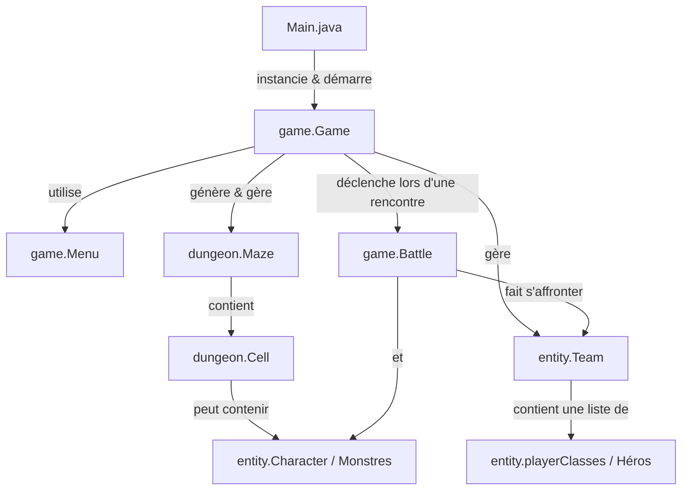

# 🗡️ Rapport de Revue de Code & Guide d'Amélioration
**Projet** : Donjon de Naheulbeuk - Fan Game (Java 2026)  
**Auteur du projet** : Quentin  
**Rôle du relecteur** : Mentor & Guide de Code Java  

---

> [!NOTE]
> **Philosophie de cette revue** : Ce rapport a été rédigé avec bienveillance et enthousiasme. **Aucune note n'est attribuée**. L'objectif est de célébrer les superbes idées déjà mises en place (génération de labyrinthe DFS, combats au tour par tour, univers de Naheulbeuk) tout en fournissant des pistes concrètes pour appliquer les **meilleures pratiques Java 2026**.

---

## 🗺️ 1. Arborescence & Flux d'Exécution

Le projet est structuré autour de 5 packages principaux situés sous `fr.hibouxe.donjon_de_naheulbeuk_fan_game` :



### Description du Flux :
1. **Lancement (`Main.java`)** : Initialise le jeu et passe la main à `Game.startGame()`.
2. **Initialisation de la Partie (`Game.java`)** :
   - Génère un labyrinthe de 10x10 (`Maze.generateMaze()`) via un algorithme de recherche en profondeur (*DFS*).
   - Ajoute des salles aléatoires (`generateRandomRooms`) et des monstres (`generateMonsters`).
   - Crée la `Team` comprenant les 7 héros de la Compagnie de Naheulbeuk.
3. **Boucle Principale** :
   - `Menu.display()` affiche la carte ASCII dans la console (`@` pour la compagnie, `M` pour les monstres).
   - Le joueur saisit une direction (`Z, Q, S, D`) ou ouvre la fiche d'équipe (`C`) ou quitte (`X`).
4. **Combats (`Battle.java`)** :
   - Si l'équipe se déplace sur une case contenant un monstre (`Cell.hasMonster()`), un combat s'engage.
   - Tour du joueur (attaque physique ou compétence spéciale/magie).
   - Tour du monstre (attaque une cible vivante au hasard).

---

## 📊 2. Grille d'Évaluation Détaillée (Synthèse 2026)

| Axe d'Évaluation | Statut | Points Forts | Pistes d'Amélioration Majeures |
| :--- | :---: | :--- | :--- |
| ⚙️ **Architecture & Design** | 🟢 Bon | Polymorphisme via `Character` et `useSpecialSkill()`. Algorithme DFS très propre dans `Maze`. | Utiliser une `MonsterFactory` pour varier les monstres. Réduire les responsabilités de `Menu`. |
| 🔒 **Encapsulation** | 🟡 À affiner | Attributs `private` dans `Maze`, `Cell`, `Team`, `Battle`. | Dans `Character`, privilégier `private` à `protected`. Ajouter `final` sur les champs immuables. |
| 📝 **Clean Code** | 🟢 Bon | Code lisible, bien aéré, nommage clair des méthodes en anglais. | Renommer le package `Item` en minuscules (`item`). Éviter les duplications dans les déplacements (`Game`). |
| 📚 **Documentation** | 🟡 À enrichir | Bons commentaires d'intention inline. | Ajouter la **JavaDoc** (`/** ... */`) sur toutes les classes et méthodes publiques. |
| 🛡️ **Robustesse** | 🟡 À sécuriser | Utilisation intelligente de `Math.max(0, ...)` pour les PV. | Sécuriser la lecture clavier (`Scanner`) contre les erreurs de saisie (`InputMismatchException`, `NumberFormatException`). |

---

## 🔍 3. Analyse Détaillée Fichier par Fichier

### 🚀 Package Racine & Point d'Entrée

#### [Main.java](file:///home/user/IdeaProjects/Donjon_de_Naheulbeuk_Fan_Game/src/fr/hibouxe/donjon_de_naheulbeuk_fan_game/Main.java)
- **Ce qui est super** : Utilisation de la syntaxe simplifiée de Java 21+ avec la méthode `void main()`.
- **Suggestion d'amélioration** :
  - La ligne `package fr.hibouxe.donjon_de_naheulbeuk_fan_game;` est absente au sommet du fichier. Ajouter le package permet de maintenir la cohérence de l'arborescence.

---

### 🎮 Package `game`

#### [Game.java](file:///home/user/IdeaProjects/Donjon_de_Naheulbeuk_Fan_Game/src/fr/hibouxe/donjon_de_naheulbeuk_fan_game/game/Game.java)
- **Ce qui est super** : Excellente structuration de la boucle de jeu et découpage clair des tentatives de déplacement (`tryMoveNorth`, `tryMoveSouth`, etc.).
- **Suggestions** :
  - **Encapsulation** : Le champ `Menu menu = new Menu();` n'a pas de modificateur d'accès. Il gagne à être `private final Menu menu = new Menu();`.
  - **DRY (Don't Repeat Yourself)** : Les 4 méthodes `tryMoveNorth/South/West/East` font exactement la même vérification sur les murs et le mouvement. On pourrait les unifier avec un `enum Direction { NORTH, SOUTH, EAST, WEST }`.
  - **Duplication de code** : Dans `playerMovement()`, `currentCell.setMonster(null);` est appelé deux fois (lignes 77 et 82).

#### [Menu.java](file:///home/user/IdeaProjects/Donjon_de_Naheulbeuk_Fan_Game/src/fr/hibouxe/donjon_de_naheulbeuk_fan_game/game/Menu.java)
- **Ce qui est super** : L'affichage ASCII du labyrinthe dans `display()` est ingénieux, très visuel et clair !
- **Suggestions** :
  - **Single Responsibility Principle (SRP)** : `Menu` contient à la fois la gestion du `Scanner` utilisateur et l'affichage complexe de la carte et des fiches d'équipe. Séparer l'affichage (View) et la saisie (InputReader) rendrait le code encore plus modulaire.
  - **Gestion d'erreur muette** : Dans `askPlayerInt()`, le bloc `catch (InputMismatchException e) {}` est vide. Si l'utilisateur tape du texte, le scanner ne consomme pas la mauvaise ligne, ce qui peut créer des boucles infinies. Il faut faire `keyboard.nextLine();` dans le catch pour vider le buffer.

#### [Battle.java](file:///home/user/IdeaProjects/Donjon_de_Naheulbeuk_Fan_Game/src/fr/hibouxe/donjon_de_naheulbeuk_fan_game/game/Battle.java)
- **Ce qui est super** : Système de combat tour par tour dynamique et amusant, avec répliques cultes de Naheulbeuk !
- **Suggestions** :
  - **Validation des entrées & Crash Safety** : `Integer.parseInt(keyboard.nextLine().trim())` (lignes 62 et 69) déclenchera une exception et fera planter le jeu si l'utilisateur entre une lettre ou appuie sur Entrée par erreur. Une petite méthode d'aide sécurisée éviterait tout crash.
  - **Hors Bornes (IndexOutOfBounds)** : Ligne 63 (`team.getMembers().get(choice)`), si le joueur saisit un nombre négatif ou supérieur au nombre de héros, une exception est levée.
  - **Héros inconscients / morts** : Dans `playerTurn()`, les héros KO apparaissent toujours dans la liste. Si on choisit un héros KO, le tour est consommé sans effet. Proposer uniquement les héros vivants améliore le confort de jeu.

---

### 🏰 Package `dungeon`

#### [Maze.java](file:///home/user/IdeaProjects/Donjon_de_Naheulbeuk_Fan_Game/src/fr/hibouxe/donjon_de_naheulbeuk_fan_game/dungeon/Maze.java)
- **Ce qui est super** : L'utilisation de `ArrayDeque` comme pile pour l'algorithme DFS est une excellente pratique recommandée en Java moderne !
- **Suggestions** :
  - **Pattern Factory** : La méthode `generateMonsters(int count)` instancie uniquement des `new Goblin()`. Une fabrique de monstres (`MonsterFactory.createRandomMonster()`) permettrait de placer aléatoirement des Orcs, Squelettes, Trolls, Spiders, etc.
  - **Immuabilité** : Le champ `Random random` peut être marqué `final`.

#### [Cell.java](file:///home/user/IdeaProjects/Donjon_de_Naheulbeuk_Fan_Game/src/fr/hibouxe/donjon_de_naheulbeuk_fan_game/dungeon/Cell.java)
- **Ce qui me plaît** : Méthode `removeWallBetween(Cell neighbor)` très élégante qui gère la suppression bidirectionnelle des murs.
- **Suggestions** :
  - **Setters Anémiques** : Des méthodes comme `setX()` et `setY()` ne sont jamais utilisées car les coordonnées d'une case ne changent pas. Les supprimer renforce l'immuabilité de l'objet.
  - **Null Safety** : `getMonster()` retourne `null` si aucun monstre n'est présent. Utiliser `Optional<Character>` éviterait les vérifications manuelles de `null`.

---

### 🛡️ Package `entity` et Sous-Packages

#### [Character.java](file:///home/user/IdeaProjects/Donjon_de_Naheulbeuk_Fan_Game/src/fr/hibouxe/donjon_de_naheulbeuk_fan_game/entity/Character.java)
- **Ce qui est super** : Classe centrale bien pensée pour représenter n'importe quelle créature (héros ou monstre).
- **Suggestions** :
  - **Encapsulation (Priorité 2026)** : Tous les champs (`name`, `healthPoint`, `attack`, etc.) sont marqués `protected`. En Java propre, on recommande d'utiliser **`private`** pour les champs, et de passer par des getters/setters protégés ou publics si nécessaire.
  - **Classe Abstraite** : `Character` est instanciée directement ? Si non, la marquer `public abstract class Character` est une excellente pratique pour exprimer qu'il s'agit d'un concept générique.

#### [Team.java](file:///home/user/IdeaProjects/Donjon_de_Naheulbeuk_Fan_Game/src/fr/hibouxe/donjon_de_naheulbeuk_fan_game/entity/Team.java)
- **Ce qui est super** : Regroupement propre de la compagnie et de ses coordonnées d'équipe.
- **Suggestions** :
  - **Immuabilité du composant** : Le champ `members` peut être marqué `final`. Le setter `setMembers` peut être supprimé au profit de méthodes comme `addMember()` ou `removeMember()`.

#### Classes des Héros (`playerClasses/`) & Ennemis (`enemy/`)
- **[Barbarian](file:///home/user/IdeaProjects/Donjon_de_Naheulbeuk_Fan_Game/src/fr/hibouxe/donjon_de_naheulbeuk_fan_game/entity/playerClasses/Barbarian.java)**, **[Dwarf](file:///home/user/IdeaProjects/Donjon_de_Naheulbeuk_Fan_Game/src/fr/hibouxe/donjon_de_naheulbeuk_fan_game/entity/playerClasses/Dwarf.java)**, **[Elf](file:///home/user/IdeaProjects/Donjon_de_Naheulbeuk_Fan_Game/src/fr/hibouxe/donjon_de_naheulbeuk_fan_game/entity/playerClasses/Elf.java)**, **[Magician](file:///home/user/IdeaProjects/Donjon_de_Naheulbeuk_Fan_Game/src/fr/hibouxe/donjon_de_naheulbeuk_fan_game/entity/playerClasses/Magician.java)**, **[Ogre](file:///home/user/IdeaProjects/Donjon_de_Naheulbeuk_Fan_Game/src/fr/hibouxe/donjon_de_naheulbeuk_fan_game/entity/playerClasses/Ogre.java)**, **[Ranger](file:///home/user/IdeaProjects/Donjon_de_Naheulbeuk_Fan_Game/src/fr/hibouxe/donjon_de_naheulbeuk_fan_game/entity/playerClasses/Ranger.java)**, **[Thief](file:///home/user/IdeaProjects/Donjon_de_Naheulbeuk_Fan_Game/src/fr/hibouxe/donjon_de_naheulbeuk_fan_game/entity/playerClasses/Thief.java)**.
- **[Goblin](file:///home/user/IdeaProjects/Donjon_de_Naheulbeuk_Fan_Game/src/fr/hibouxe/donjon_de_naheulbeuk_fan_game/entity/enemy/Goblin.java)**, **[Orc](file:///home/user/IdeaProjects/Donjon_de_Naheulbeuk_Fan_Game/src/fr/hibouxe/donjon_de_naheulbeuk_fan_game/entity/enemy/Orc.java)**, **[Skeleton](file:///home/user/IdeaProjects/Donjon_de_Naheulbeuk_Fan_Game/src/fr/hibouxe/donjon_de_naheulbeuk_fan_game/entity/enemy/Skeleton.java)**, **[Spider](file:///home/user/IdeaProjects/Donjon_de_Naheulbeuk_Fan_Game/src/fr/hibouxe/donjon_de_naheulbeuk_fan_game/entity/enemy/Spider.java)**, **[Troll](file:///home/user/IdeaProjects/Donjon_de_Naheulbeuk_Fan_Game/src/fr/hibouxe/donjon_de_naheulbeuk_fan_game/entity/enemy/Troll.java)**, **[Undead](file:///home/user/IdeaProjects/Donjon_de_Naheulbeuk_Fan_Game/src/fr/hibouxe/donjon_de_naheulbeuk_fan_game/entity/enemy/Undead.java)**.
- **Ce qui est super** : L'implémentation spécifique de `useSpecialSkill()` dans `Magician`, `Dwarf` et `Elf` apporte du dynamisme !
- **Suggestions** :
  - **Nom de Package** : En Java, les packages sont toujours écrits entièrement en minuscules (`playerclasses` au lieu de `playerClasses`).
  - **Attributs personnalisés** : Dans `Elf.java`, l'Elf demande au joueur quel coéquipier soigner via `Scanner`. Pour garder `Character` indépendant de la console, on peut passer un objet d'action ou une cible déjà sélectionnée.

#### Package `boss/` et `Item/`
- **[Gzor.java](file:///home/user/IdeaProjects/Donjon_de_Naheulbeuk_Fan_Game/src/fr/hibouxe/donjon_de_naheulbeuk_fan_game/entity/boss/Gzor.java)**, **[Zangdar.java](file:///home/user/IdeaProjects/Donjon_de_Naheulbeuk_Fan_Game/src/fr/hibouxe/donjon_de_naheulbeuk_fan_game/entity/boss/Zangdar.java)**, **[OffensiveEquipment.java](file:///home/user/IdeaProjects/Donjon_de_Naheulbeuk_Fan_Game/src/fr/hibouxe/donjon_de_naheulbeuk_fan_game/Item/OffensiveEquipment.java)**, **[DefensiveEquipment.java](file:///home/user/IdeaProjects/Donjon_de_Naheulbeuk_Fan_Game/src/fr/hibouxe/donjon_de_naheulbeuk_fan_game/Item/DefensiveEquipment.java)**.
- **Remarque** : Ces classes sont actuellement vides (travail en cours). Penser à renommer le package `Item` en `item` (minuscules).

---

## 💡 4. Exemples de Refactorisation Recommandés

### 1. Sécuriser la saisie des entiers (`InputReader`)
```java
public int askPlayerIntSafe(String prompt, int min, int max) {
    while (true) {
        System.out.print(prompt);
        String input = keyboard.nextLine().trim();
        try {
            int value = Integer.parseInt(input);
            if (value >= min && value <= max) {
                return value;
            }
            System.out.println("❌ Veuillez entrer un nombre entre " + min + " et " + max + ".");
        } catch (NumberFormatException e) {
            System.out.println("❌ Saisie invalide. Veuillez entrer un nombre.");
        }
    }
}
```

### 2. Encapsulation stricte dans `Character`
```java
public abstract class Character {
    private final String name;
    private final String type;
    private int level;
    private int healthPoint;
    private int manaPoint;
    private int attack;
    private int magicAttack;
    private int defense;
    private int magicDefense;

    public Character(String name, String type, int level, int healthPoint, int manaPoint,
                     int attack, int magicAttack, int defense, int magicDefense) {
        this.name = name;
        this.type = type;
        this.level = level;
        this.healthPoint = healthPoint;
        this.manaPoint = manaPoint;
        this.attack = attack;
        this.magicAttack = magicAttack;
        this.defense = defense;
        this.magicDefense = magicDefense;
    }
    
    // Getters et Setters appropriés...
}
```

### 3. Factory Pattern pour les Monstres (`MonsterFactory`)
```java
package fr.hibouxe.donjon_de_naheulbeuk_fan_game.entity.enemy;

import fr.hibouxe.donjon_de_naheulbeuk_fan_game.entity.Character;
import java.util.Random;

public class MonsterFactory {
    private static final Random RANDOM = new Random();

    public static Character createRandomMonster() {
        int roll = RANDOM.nextInt(6);
        return switch (roll) {
            case 0 -> new Goblin();
            case 1 -> new Orc();
            case 2 -> new Skeleton();
            case 3 -> new Spider();
            case 4 -> new Troll();
            default -> new Undead();
        };
    }
}
```

---

## 🌟 Conclusion

Félicitations Quentin ! Le projet est déjà très avancé, ludique, et techniquement solide avec son algorithme de génération de labyrinthe et son moteur de combat tour par tour. En appliquant ces petites améliorations sur l'encapsulation, la sécurité des saisies et la documentation, ton code atteindra un niveau de qualité exemplaire ! 🚀
