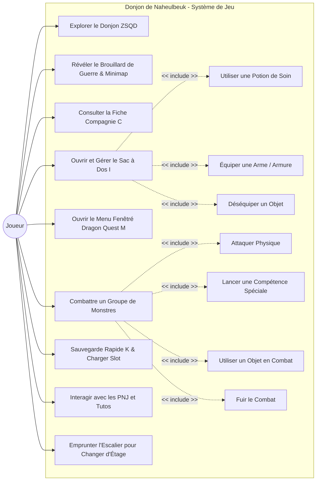

# 🦉 Donjon de Naheulbeuk - Fan Game

Jeu de rôle et d'exploration de donjon en Java, inspiré de l'univers de la célèbre saga audio *Le Donjon de Naheulbeuk*. Ce projet met en œuvre un moteur graphique moderne 3D HD-2D basé sur LibGDX et LWJGL3, ainsi que les principes fondamentaux de l'ingénierie logicielle (Patron MVC, Principes SOLID, Clean Architecture et Injection de Dépendances).

---

## 1. Fonctionnalités Principales

- **Moteur Graphique HD-2D (LibGDX 1.12.1 & LWJGL3)** : Fenêtre OpenGL 1280x720 à 60 FPS avec MSAA x4. Caméra 3D à interpolation fluide (LERP) et sprites 2D billboards orientés face caméra.
- **Génération Procédural PMD (Style Pokémon Donjon Mystère)** : Découpe du donjon en secteurs 3x3, salles rectangulaires interconnectées par couloirs L-Shape et placement garanti de l'escalier à l'intérieur d'une salle.
- **Formation Tactique en 3 Lignes (Combat Dragon Quest)** : Disposition des 7 héros de la Compagnie sur 3 lignes de profondeur en quinconce (Ligne Arrière pour la Magicienne et l'Elfe, Ligne Médiane pour le Ranger et la Voleuse, Ligne de Front pour le Barbare, le Nain et l'Ogre).
- **Gestionnaire Bilingue AZERTY / QWERTY** : Détection automatique de la disposition clavier système et correspondance exacte des codes touches matériels GLFW/LWJGL3.
- **Interface UI 2D & Menu Fenêtré Style Dragon Quest** : Minimap 2D translucide en haut à droite, badge d'étage et menu fenêtré bleu nuit à bordure dorée accessible via les touches M ou ECHAP.
- **Sauvegarde Multi-Slots & Sauvegarde Rapide** : Gestion de 3 emplacements de sauvegarde distincts et fonction de Sauvegarde Rapide à usage unique.
- **Brouillard de Guerre (Fog of War)** : Révélation progressive des salles du donjon et de la minimap au fil des déplacements du joueur.

---

## 2. Diagrammes UML Ultra-Complets

### Diagramme de Cas d'Utilisation (Use Case Diagram)



### Diagramme de Classes Exhaustif (Class Diagram)

```mermaid
classDiagram
    class IGameView {
        <<interface>>
        +displayDungeon(Dungeon dungeon)
        +askBattleAction(Character attacker) int
    }

    class IMenuView {
        <<interface>>
        +displayMessage(String message)
        +askPlayerInt() int
    }

    class ICombatView {
        <<interface>>
        +displayBattleStatus(List~Character~ monsters, Team team)
        +askBattleAction(Character attacker, boolean isFleeOnly) int
    }

    class IExplorationView {
        <<interface>>
        +displayFloorIntro(int floor)
    }

    class GraphicHD2DView {
        -Lwjgl3Application app
        -HD2DGameApp gameApp
        +displayDungeon(Dungeon dungeon)
    }

    class ConsoleMenu {
        -Scanner keyboard
        +displayMessage(String message)
    }

    class Game {
        -Dungeon maze
        -Team team
        -IGameView view
        +start()
    }

    class ExplorationController {
        -Dungeon maze
        -Team team
        -IGameView view
        +tryMoveNorth() boolean
        +tryMoveSouth() boolean
        +tryMoveWest() boolean
        +tryMoveEast() boolean
    }

    class BattleController {
        -Team team
        -List~Character~ monsters
        -ICombatView menu
        +start() boolean
    }

    class Dungeon {
        #int width
        #int height
        #Cell[][] grid
        -MonsterAI monsterAI
        -FogOfWarManager fogManager
        +updateFogOfWar(int playerX, int playerY, int radius)
    }

    class TutorialDungeon {
        +prepareFloor(int floorNumber, Team team) boolean
    }

    class NaheulbeukDungeon {
        +generate()
    }

    class Cell {
        -int x
        -int y
        -boolean wall
        -boolean stairs
        -boolean discovered
        -Item item
        -List~Character~ monsters
        +isWalkable() boolean
    }

    class Team {
        -List~Character~ members
        -List~Item~ inventory
        -int x
        -int y
        -int activeLeaderIndex
        +addItem(Item item) boolean
    }

    class Character {
        #String name
        #String type
        #int level
        #int healthPoint
        #int maxHealthPoint
        #int attack
        #int magicAttack
        #int defense
        #int magicDefense
        #int speed
        #Equipment weaponSlot
        #Equipment chestSlot
        #List~Skill~ skills
        +equip(Equipment equipment) boolean
        +gainXp(int amount) boolean
    }

    class Ranger {
    }
    class Dwarf {
    }
    class Elf {
    }
    class Magician {
    }
    class Barbarian {
    }
    class Ogre {
    }
    class Thief {
    }

    class Orc {
    }
    class Goblin {
    }
    class Skeleton {
    }
    class Spider {
    }
    class Troll {
    }
    class Undead {
    }
    class Golem {
    }
    class Zangdar {
    }

    class Skill {
        -String name
        -String description
        -int resourceCost
        +execute(Team team, Character target) String
    }

    class Item {
        #String name
        #String description
        +use(Character target) boolean
    }

    class Equippable {
        <<interface>>
        +getSlot() EquipmentSlot
        +getCategory() EquipmentCategory
        +canBeEquippedBy(Character hero) boolean
    }

    class Equipment {
        #EquipmentSlot slot
        #EquipmentCategory category
        #int attackBonus
        #int defenseBonus
    }

    class Potion {
        -int healAmount
        +use(Character target) boolean
    }

    class HD2DGameApp {
        -PerspectiveCamera camera
        -DungeonSceneRenderer dungeonRenderer
        -BattleArenaRenderer battleRenderer
        -HUDRenderer hudRenderer
        +render()
    }

    class DungeonSceneRenderer {
        +render(ModelBatch modelBatch, DecalBatch decalBatch, Environment environment, PerspectiveCamera camera, int playerX, int playerY)
    }

    class BattleArenaRenderer {
        +render(ModelBatch modelBatch, DecalBatch decalBatch, Environment environment, PerspectiveCamera camera)
    }

    class HUDRenderer {
        +renderHUD(Dungeon dungeon, int playerX, int playerY, int currentFloor, GameState state)
    }

    IMenuView <|-- IGameView
    ICombatView <|-- IGameView
    IExplorationView <|-- IGameView

    IGameView <|.. GraphicHD2DView
    IGameView <|.. ConsoleMenu

    Dungeon <|-- TutorialDungeon
    Dungeon <|-- NaheulbeukDungeon
    Dungeon --> Cell

    Character <|-- Ranger
    Character <|-- Dwarf
    Character <|-- Elf
    Character <|-- Magician
    Character <|-- Barbarian
    Character <|-- Ogre
    Character <|-- Thief

    Character <|-- Orc
    Character <|-- Goblin
    Character <|-- Skeleton
    Character <|-- Spider
    Character <|-- Troll
    Character <|-- Undead
    Character <|-- Golem
    Character <|-- Zangdar

    Item <|-- Equipment
    Equippable <|.. Equipment
    Item <|-- Potion

    Character --> Equipment
    Character --> Skill
    Team --> Character
    Team --> Item

    ExplorationController --> Dungeon
    ExplorationController --> Team
    ExplorationController --> IGameView

    BattleController --> Team
    BattleController --> Character
    BattleController --> ICombatView

    GraphicHD2DView --> HD2DGameApp
    HD2DGameApp --> DungeonSceneRenderer
    HD2DGameApp --> BattleArenaRenderer
    HD2DGameApp --> HUDRenderer
```



---

## 3. Architecture et Conception (MVC & SOLID)

Le projet respecte une séparation stricte des responsabilités :

- **Modèle (`fr.hibouxe.donjon_de_naheulbeuk_fan_game.model`)** : Contient l'état et la logique métier de l'application sans dépendance à l'interface console.
- **Vue (`fr.hibouxe.donjon_de_naheulbeuk_fan_game.view`)** : Moteur de rendu graphique LibGDX 3D (`GraphicHD2DView`, `HD2DGameApp`, `DungeonSceneRenderer`, `BattleArenaRenderer`, `HUDRenderer`) et alternative Console (`ConsoleMenu`).
- **Contrôleur (`fr.hibouxe.donjon_de_naheulbeuk_fan_game.controller`)** : Orchestration de la boucle de jeu (`Game`, `ExplorationController`, `BattleController`).

### Inversion de Dépendances et Pattern Strategy
La communication entre la logique métier et le rendu s'effectue exclusivement à travers l'interface abstraite `IGameView`. Cette architecture permet d'interchanger à tout moment le moteur 3D LibGDX et le mode console ASCII sans modifier une seule ligne du code métier.

---

## 4. Arborescence du Projet

```text
src/fr/hibouxe/donjon_de_naheulbeuk_fan_game/
├── Main.java                          # Point d'entrée principal
├── controller/                        # Contrôleurs de jeu et d'exploration
│   ├── BattleController.java
│   ├── ExplorationController.java
│   ├── Game.java
│   └── HubController.java
├── model/                             # Modèle métier
│   ├── dungeon/                       # Matrice du labyrinthe et algorithme PMD
│   ├── entity/                        # Héros, monstres et boss
│   │   ├── boss/
│   │   ├── enemy/
│   │   └── playerClasses/
│   ├── item/                          # Objets, potions et équipements
│   └── save/                          # Gestionnaire de sauvegarde sérialisé
└── view/                              # Interface et rendu graphique
    ├── console/                       # Rendu ASCII terminal
    ├── contract/                      # Interfaces abstrait IGameView
    └── graphic/                       # Application 3D LibGDX et Renderers SRP
        └── renderers/
            ├── BattleArenaRenderer.java
            ├── DungeonSceneRenderer.java
            └── HUDRenderer.java
```

---

## 5. Compilation et Exécution

### Prérequis
- Java Development Kit (JDK) 21 ou supérieur.
- JetBrains JDK / OpenJDK avec accès OpenGL 3.0+.

### Compilation avec javac
```bash
javac -d bin -cp "lib/*:src" -sourcepath src src/fr/hibouxe/donjon_de_naheulbeuk_fan_game/Main.java
```

### Lancement du Jeu
```bash
java -cp "lib/*:bin" fr.hibouxe.donjon_de_naheulbeuk_fan_game.Main
```

---

## 6. Documentation Javadoc

La documentation Javadoc complète du projet est générée dans le répertoire `docs/`.

Pour régénérer le site HTML Javadoc :
```bash
javadoc -d docs -cp "lib/*:src" -sourcepath src -subpackages fr.hibouxe.donjon_de_naheulbeuk_fan_game
```
