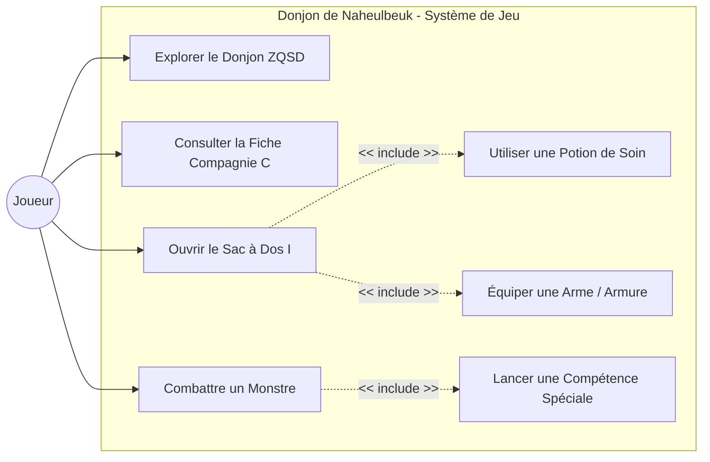
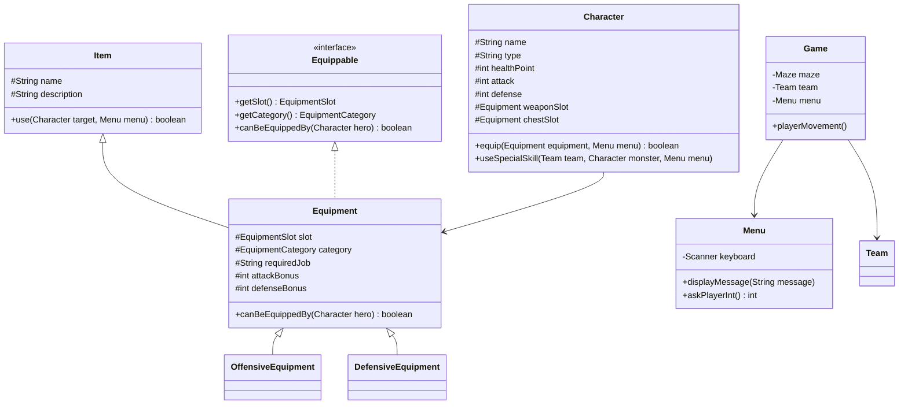

🦉 Donjon de Naheulbeuk - Fan Game

Jeu de rôle textuel et d'exploration de donjon en Java, inspiré de l'univers de la saga audio *Le Donjon de Naheulbeuk*. Ce projet met en œuvre les principes fondamentaux de la programmation orientée objet (POO), le patron d'architecture MVC, le principe d'injection de dépendances et les principes SOLID.

## Fonctionnalités

- **Génération procédurale de donjon** : Création de labyrinthes 2D avec salles ouvertes et chemins interconnectés via un algorithme de DFS Backtracking.
- **Exploration et carte ASCII** : Déplacement au clavier (ZQSD), détection dynamique des murs et affichage en temps réel de la position de la compagnie (`@`), des monstres (`M`) et des coffres (`C`).
- **Gestion de la compagnie et compétences** : Gestion des caractéristiques des aventuriers (Ranger, Nain, Élfette, Magicienne, Barbare, Ogre, Voleur) avec compétences spéciales uniques (Hurlement Barbare, Écrasement d'Ogre, Tir de Précision, Attaque Sournoise, Soin, Boule de Feu).
- **Système d'équipements et emplacements (Slots)** : 6 emplacements dédiés (Tête, Torse, Jambes, Bijou, Arme, Main gauche), gestion des bonus d'attaque/défense et restrictions de classe (Hache Durandil, Pagne Sauvage, Robe d'Archimage).
- **Inventaire et coffres au trésor** : Loot aléatoire dans les coffres, consultation du sac à dos (`I`) et utilisation polymorphique d'objets (potions de soin, équipements).
- **Système de combat tour par tour** : Combat tactique alternant attaques physiques et compétences spéciales contre divers types d'ennemis (Gobelins, Orcs, Squelettes, Trolls).

## Diagrammes UML

### Diagramme de Cas d'Utilisation (Use Case Diagram)



### Diagramme de Classes (Class Diagram)



## Architecture et Conception

Le projet est conçu selon une séparation stricte des responsabilités (Patron MVC & SOLID) :

- **Modèle (`fr.hibouxe.donjon_de_naheulbeuk_fan_game.dungeon`, `entity`, `item`)** : Contient l'état et la logique métier de l'application sans dépendance à l'interface console.
- **Vue (`fr.hibouxe.donjon_de_naheulbeuk_fan_game.game.Menu`)** : Centralise tous les rendus visuels, les affichages de textes (`displayMessage`) et la saisie sécurisée de l'utilisateur (`askPlayerInt`, `askPlayerString`).
- **Contrôleur (`fr.hibouxe.donjon_de_naheulbeuk_fan_game.game.Game`, `Battle`)** : Orchestre la boucle de jeu, les déplacements, les transitions de combat et les interactions.

### Injection de Dépendances
L'instance unique du composant `Menu` est créée au point d'entrée (`Main.java`) et injectée via les constructeurs de `Game`, `Battle` et des compétences. Aucune classe métier n'instancie de `Scanner` ou d'élément d'I/O en interne.

## Structure du Projet

```text
src/fr/hibouxe/donjon_de_naheulbeuk_fan_game/
├── Main.java
├── dungeon/          # Matrice du labyrinthe et algorithmes de génération
├── entity/           # Classes de personnages, héros, monstres et boss
│   ├── playerClasses/
│   ├── enemy/
│   └── boss/
├── item/             # Système d'objets et potions
│   ├── usable/
│   └── equipment/    # Système d'équipements, slots et catégories
│       ├── offensiveEquipment/
│       └── defensiveEquipment/
└── game/             # Vue (Menu) et Contrôleurs (Game, Battle)
```

## Compilation et Exécution

### Prérequis
- Java Development Kit (JDK) 21 ou supérieur.

### Compilation
```bash
javac -d bin -sourcepath src src/fr/hibouxe/donjon_de_naheulbeuk_fan_game/Main.java
```

### Exécution
```bash
java -cp bin fr.hibouxe.donjon_de_naheulbeuk_fan_game.Main
```

## Documentation Javadoc

La documentation Javadoc complète du projet est générée dans le dossier `docs/` et hébergée via GitHub Pages.

```bash
javadoc -d docs -sourcepath src -subpackages fr.hibouxe.donjon_de_naheulbeuk_fan_game
```
